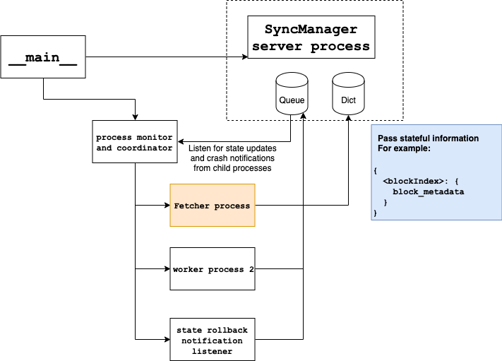
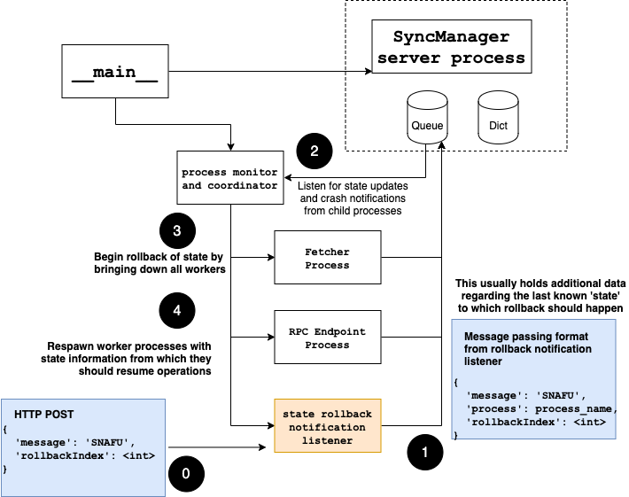

# py-multiprocessing-coordination

This code accompanies a PyCon India 2019 proposal - [How we built a State Machine to keep up with a 1200+ Txs/second blockchain protocol
](https://in.pycon.org/cfp/2019/proposals/how-we-built-a-state-machine-to-keep-up-with-a-1200-txssecond-blockchain-protocol) 

## Components

### producer.py
This produces fake "blocks" of data in the following format

```json
{
    "hash"': "hexstring",
    "metaData": "a random string"
}
``` 

Make a GET call to get a fake block
```bash
curl http://localhost:5990/2
```

You will be returned something like this

```json
{
    "hash": "b097a1871fb9674f495ffd21e2fee1dfda51ec25fd8f91ddad1b81291f120f6a",
    "metaData": "meta8564765"
}
```

### core.py

This has a few processes running in parallel and they interact and share state via a `SyncManager` queue and dict.

#### `class FetcherProcess`


It fetches fake blocks as described above and stores them in a shared mapping.

#### `class MonitorRPCEndpointProcess`

This starts a tornado server on localhost, port `5233` which can be queried with a `GET` request to get the current state of the shared mapping.

```json
{
  "processDir": {
        "Fetcher1": {
            "pid": 4789
        },
        "Lookout": {
            "pid": 4790
        },
        "Monitor": {
            "pid": 4791
        }
    },
    "596": {
        "hash": "395e26d58898c579f00bce988a654c8c7a29ee431c38212db40bffbdd02d7103",
        "metaData": "meta3718521"
    },
    "597": {
        "hash": "0c249028c7f3fe1ea25bcea5de9b46b1c5ac980aab7561d416f23852b4b9d9e2",
        "metaData": "meta5594925"
    },
    "598": {
        "hash": "9c7205bb9b451c12f0c12c8954f206ca5471e601b9a8bd4c9b82e5d9b38be527",
        "metaData": "meta3256633"
    },
    "599": {
        "hash": "337430917ba5c0f0031f220355b0fb70d34528923f7468976ca6912762434094",
        "metaData": "meta2751058"
    },
    "600": {
        "hash": "257935e24f3f4f6977b6c3b67c5394753807772c31dfd273aa65fb7ed4adca6c",
        "metaData": "meta2287915"
    },
    "601": {
        "hash": "be486e57bec1edd48b527d66563a32f411cda69af8e5ac5f4c5e03890c80dd1f",
        "metaData": "meta2432676"
    }
}
```

#### `class PanicLookoutProcess`
This sets up another Tornado server on `localhost`, port `5232` to which you can `POST` a request like

```json
{
  "message": "SNAFU",
  "rollbackIndex": 10
}

```

This will cause the running processes to be suspended and `FetcherProcess` will resume fetching from "block" 10 as specified by `rollbackIndex`



### procmon.py

You can use the code in here to generate graphs on memory and CPU usage via `statsd` and `grafana`

[Follow this StackExchange answer](https://unix.stackexchange.com/a/414770) under section `graphite-stack & statsd`

###File: `cache`
The shared mapping being updated by the `FetcherProcess` is [pickled](https://docs.python.org/3/library/pickle.html) to disk in this file during shutdown and restored during start up of `core.py`

You will see something like this in the logs during the second and subsequent runs of `core.py`

``` 
core-super_manager_init: python3.6: Initialized SyncManager for shared queue and mapping
core-<module>: CacheFileLoad
core-run: Got begin index for fetcher
core-run: 595
``` 

and during shutdown,

``` 
Fetcher1 Received SIGINT. Going down...
core-shutdown: Shutting down tornado
core-<module>: Main received SIGINT. Going down.
Recieved SIGINT. Shutting down.
core-<module>: Saving to cache file
core-<module>: SyncManager shut down
```

## TODOs:

- [x] Complete the implementation of `FetcherProcess` to pull data from a simulated data source

- [x] Add message passing on crash to `PanicLookoutProcess`

- [x] Add stateful information passing to `PanicLookoutProcess`

- [x] Add CPU and I/O profiling for some handy statistics